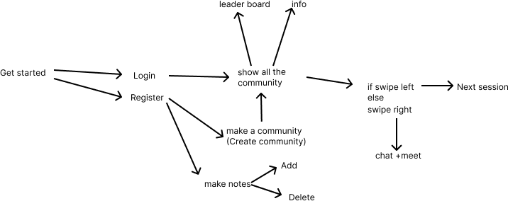

# Studyr

## Overview
Studyr is a mobile application designed to facilitate collaborative studying among students. It offers various features including:

- **Community**: Students can join or create communities based on their interests and subjects.
- **One on One Chat**: Students can communicate with each other within communities or through private messages.
- **Group Study Video Call Feature**: group study sessions using video calls.
- **Notes**: Students can create and delete notes.
- **Leaderboard**: Students can compete on a leaderboard based on points earned from activities.
- **Virtual friend** :Chatbot for Student Doubt Resolution.
  
## Purpose
Studyr is a valuable tool designed to enhance collaboration, engagement, communication, and access to resources for students. It offers a user-friendly and efficient platform to support student success in their studies.

## Objective
- **Improved Collaboration**: Students can easily collaborate on projects and assignments through communities, chat, and video calls.
- **Increased Engagement**: By facilitating collaboration and providing a leaderboard for competition, Studyr encourages students to be more engaged in their studies.
- **Improved Communication**: Studyr provides a platform for students to communicate outside of the classroom, fostering relationships and a sense of community.

## Target Audience
Studyr caters to a diverse audience including students from various educational levels, educators, professionals, self-learners, and special interest groups. Whether for remote learners, international students, or homeschooling communities, Studyr offers a comprehensive solution for collaborative studying and knowledge sharing.


## Getting Started
## Step-by-Step Guide to Build a Flutter Project as a Release APK

1. **Clone the Project**:
   - First, clone or download the Flutter project from its repository using Git or directly from its source.

2. **Navigate to Project Directory**:
   - Open a terminal or command prompt and navigate to the directory of the third-party Flutter project you've just downloaded.

3. **Check Flutter Version**:
   - Ensure that you have a compatible version of Flutter installed. You can check the Flutter version by running:
     ```
     flutter --version
     ```
   - If needed, you can switch to a compatible Flutter version using `flutter version <version_number>`.

4. **Install Dependencies**:
   - Run the following command in the project directory to get all the dependencies needed for the project:
     ```
     flutter pub get
     ```

5. **Build Release APK**:
   - Use the following command to build the release APK:
     ```
     flutter build apk --release
     ```
   - This command generates the release APK file in the `build/app/outputs/flutter-apk` directory within the project folder.

6. **Testing**:
   - Test the release APK thoroughly to ensure that it works as expected. If there are any issues, you might need to troubleshoot or reach out.

## Architecture
The Studyr app follows a client-server architecture. The client is developed using Flutter, while the server is built with Node.js. Communication between the client and server occurs via a RESTful API.


## Data Model
Studyr utilizes a relational database to store data, with main entities including:
- **User**: Stores user information such as name, password and communities which user joined.
- **Community**: Stores details about communities like name, list of participants, list of admin(for control access) and description.
- **Post**: Stores information about posts, such as their title, content, and author.
- **Message**: Stores information about messages, such as their sender, recipient, and content.
## Work-Flow 


   


## Features

### Communities
- Students can join or create communities based on interests and subjects.
- Communities support multiple members.
- Members can engage in various activities within communities including posting messages, sharing notes, and joining video calls.
- Swipe feature to create a communities

### Chat
- Students can chat within communities or through private messages.
- Chat functionality supports both one-on-one and group conversations.
- Students can exchange text messages.

### Notes
- Students can create and delete.

### Leaderboard
(still in progress)
- Students can compete on a leaderboard based on points earned from activities.
- Points are awarded for actions such as posting, commenting, and participating in video calls.
- The leaderboard is updated in real-time.

### Virtual friend
- Chatbot for Student Doubt Resolution
- It is an innovative chatbot designed to assist students in resolving their academic doubts and queries efficiently. Developed specifically for students, Virtual Friend serves as a reliable companion throughout their      educational journey, offering instant assistance and guidance whenever needed.
### Group Study Video Call Feature
-It is an integral component of our platform, designed to facilitate collaborative learning among students in a virtual environment. With this feature, students can engage in interactive group study sessions, enabling them to communicate, share ideas, and work together on academic tasks effectively.

## Conclusion:
- Studyr is a valuable tool for students who want to improve their collaboration, engagement, communication, and access to resources. It is a user-friendly and efficient platform that can help students succeed in their studies.


